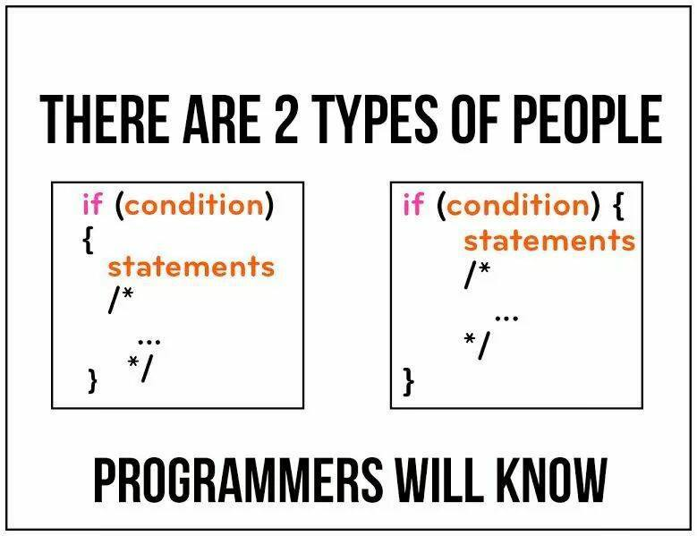

## Previously…

In the [Bank Database Project](https://nickkaw.github.io/projects/bankdb-app.html), I had briefly talked about my take on coding standards. To restate, I believe that coding standards are crucial in organizing and formatting code into readable sections. However when it comes to learning a programming language, I do not think that coding standards necessarily help in that regard. This is because in my opinion, coding standards are more of a stylistic technique used to create uniformity in code among multiple programmers.

## ESLint

Throughout this past week I’ve been using ESLint in IntelliJ, one type of coding standard for Javascript. And although ESLint does help to improve the overall legibility and organization of code, I have personally found that ESLint can be extremely petty in certain scenarios. For example, there are no spaces in between a newly created function and its parameters. But when you use a condition statement or an iteratee function in a parameter (i.e. _.reduce), there has to be a space between the condition or function name and the parameter. Finally,  the pettiest thing that ESLint wants me to do is to add a newline after the last line of code. I swear that every time I finish a WOD, ESLint always reminds me to add a newline after the last line of code. The worst thing about it is that the newline doesn’t even show up in github when viewing the source code. Despite all this badmouthing, I ultimately think that ESLint is a pretty ordinary and fair coding standard.

## IntelliJ

In addition to being introduced to ESLint, we have also been introduced to the IntelliJ IDE. Even though I have not played around with IntelliJ all that much, there are things that are easily noticeable. For instance, there are lots of different options we have in the settings menu, which ultimately leads to lots of customization. Because of this we are able to have ESLint installed in IntelliJ and set it to automatically and continuously check our program. Unfortunately, this continuous automation setting can be annoying at times, especially since there are lots of error notifications while we are writing code. However, it has only been one week since using IntelliJ and ESLint, so there are bound to be things in which I like and dislike about it.

## Conclusion

To summarize, while I do think that coding standards do help to make code easier to read, I do not really think that it helps us learn a programming language because it focuses on styling code rather than the functionality of code. As I’ve experienced using ESLint in IntelliJ for the past week, I do have questions regarding certain practicality and consistency problems in ESLint. However when it comes to the automation ESLint setting in IntelliJ, it can prove to be quite a nuisance for me. Hopefully, this experience is just a short-term issue, and as we practice more using ESLint and IntelliJ, it won’t be as big of a deal.

Image is from this [reddit post](https://www.reddit.com/r/ProgrammerHumor/comments/uin1ju/which_one_are_you/). 
