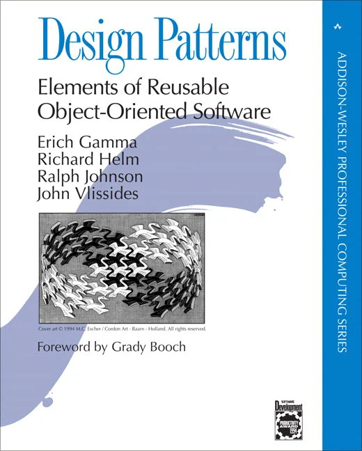
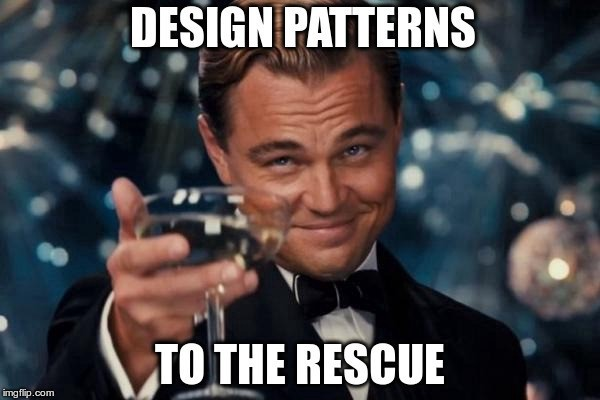

## Abstract Patterns in Life

As a prelude to this essay, I’d like to take a moment to think about some of the general patterns that we follow in life. No, I’m not talking about your personal lifestyle habits (although it might be), I’m talking about the patterns people might do after hearing or seeing someone else do it. Many examples of these types of patterns occur in cooking. For instance when boiling pasta noodles, cooking influencers tend to emphasize putting lots of salt in the water. A different example appears in song writing. For example, there are many song lyrics that are typically structured in a verse-chorus, verse-chorus, bridge-chorus arrangement. These are some of my examples of general patterns that occur throughout many people's everyday lives. Do you have any that you would like to share? I can assure you that every person follows a pattern, we are just instinctively performing them without realizing it. 

Although it might be a little difficult to think of patterns generally, a simpler explanation is that these patterns are typical solutions to commonly recurring problems. One thing to note is that not everyone has to follow these patterns. In my case, I do not salt boiling water when cooking pasta noodles, because to me it doesn’t make that big of a difference and also it's a waste of salt. Instead, these patterns depict a general model, design, or guide for others to potentially use and follow. And as a result, a group of developers were inspired by this idea and created the [“Gang of Four” (1994) book](https://www.amazon.com/Design-Patterns-Object-Oriented-Addison-Wesley-Professional-ebook/dp/B000SEIBB8), a book around design patterns specifically made for software developers. The book mainly discusses design patterns for C++, however their perspective on patterns continued and expanded to many other aspects of computer science. 

## Importance of Design Patterns in Software Development

Design patterns are significantly important in software development. As developers, we are always trying to solve problems quickly with the least amount headaches, bugs, and errors. However, just starting to build a possible solution from a blank screen is difficult. This is where design patterns come to the rescue. A design pattern is a template that can be used in many different situations to guide how the problem should be addressed. Essentially developers can use these design patterns to efficiently produce solutions and reduce errors that might have occurred. 

## Types of Design Patterns & Examples in Manoa Xchange

There are many kinds of design patterns, but most patterns fall into one of three categories: creational patterns, structural patterns, and behavioral patterns. Creational patterns deal with the creation of an object. Structural patterns deal with the representation of objects or class structure. Behavioral patterns deal with the management and interaction between objects. One  of the most popular design patterns used for web application is the Model-View-Controller (MVC), which is actually a combination of creational and behavioral (and possibly structural if applicable). 

In Manoa Xchange, my team’s web application inspired by craigslist, we use Meteor to incorporate the MVC design pattern. This pattern logically divides the application into three components: model, view, and controller. In our project, we are using MongoDB as our database (model), React to work on the UI design (view), and React Router as the mediator to control what is being displayed when the user interacts with the application (controller). Our project also uses singletons, for every collection that is being exported as an instance. These are just a few of many other examples of design patterns in Manoa Xchange. In conclusion, it is extremely convenient to use these design patterns as they give lots of possible solutions or ideas to solutions in development.

