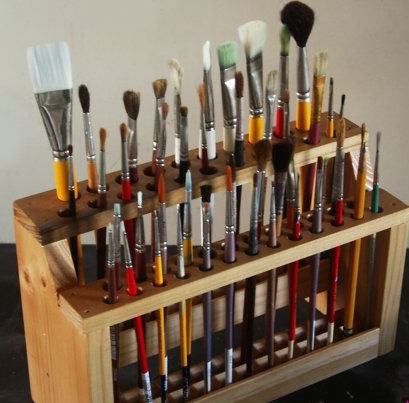

## Ideas/Suggestions

- UH Gamer Network/E-Sports Training
- Bathroom & Waterfountain Review (Yelp)
- Food Hunter (Restaurants & Food Trucks) (UH Yelp)

## 1. Overview (including “The problem” and “The solution”)

#### Food Hunter
The Problem : Yelp is a common website to use to find reviews on restaurants and food trucks. However, the reviewer demographics are too broad.

The Solution : Produce a "Yelp" like application for ammentities around UH Manoa Campus. In this case, Food Hunter website focuses on food related ammenities.  

## 2. Mockup page ideas

## 3. Use case ideas

## 4. Beyond the basics

Ever since I first grasped a paintbrush, I’ve always been eager to learn about design. Design is such a complex concept. For example, when looking at abstract art, its meaning can be completely different for different people. It motivates a person to think thoughtfully and has the potential to submerge them in a sea of imagination. It’s that special relationship between the viewer and the art that makes something as technical as software engineering interesting to me.

I never used to think that design and technology went hand in hand.  Thus, learning about software engineering and the role of design has been incredibly interesting to me. Design, implementation, and management are just some of the many things I wish to learn more about. Good art, in a way, makes a person question it. They become joined in the idea of visualization – where captivation meets inspiration.

I am now starting to take a Software Engineering class. I hope to learn a lot through the course, but I know it will be just the beginning of my journey. By the time I’m done with it, I hope I’ve learned enough to take the next step in my life as a developer. But until then, my fire will keep on burning.
