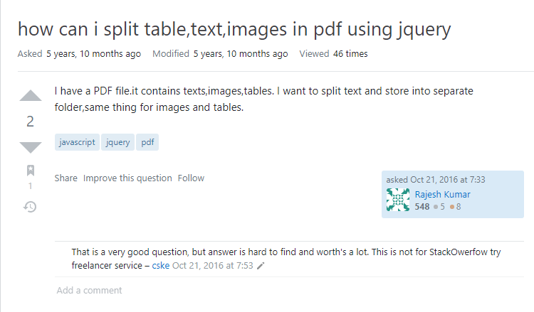
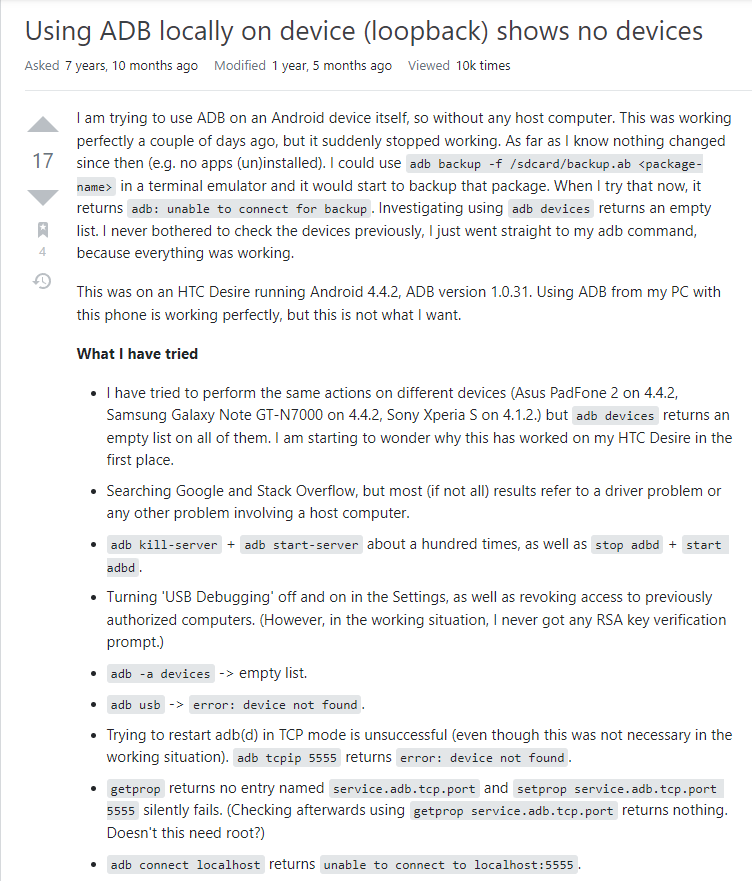
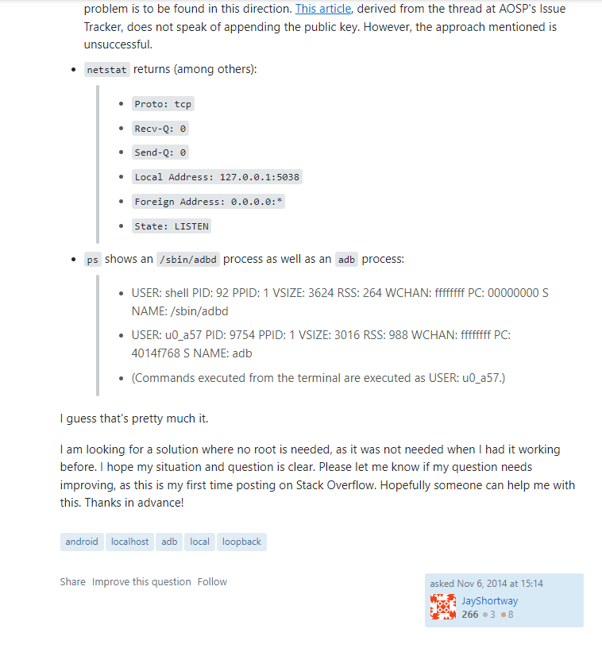

## "Are there any questions?"

Said the instructor to the class. Whenever this or a similar situation occurs, I tend to refrain myself from opening my mouth. Even when I do have a question in mind I never say them outloud, either because I don’t know how to phrase my question, or I would feel embarrassed about raising my voice and holding the class back just because I had a question. In the end, I would not do anything because I’m afraid. I would like to believe that this is the case for the majority of students. Throughout my college experience, I’ve noticed the same passive behavior in both myself and other classmates in most of my classes. However one exception to this behavior would be in the ICS courses, where a countless number of questions are asked. 

## Ordering Questions by Quality

Now that I’m thinking back, it is interesting observing the differences between the amount of questions asked in an ICS course versus any other standard courses. Because of the amount of questions asked in an ICS class, I would start to unconsciously rank questions based on the quality, and the context of where and when it is being asked. These questions can be put on a spectrum ranging from completely stupid to absolutely outstanding. I assume it is natural that computer science students ask lots of questions in order to receive help on their code or their understanding. With access to the internet, people can now ask questions on the web to communities scattered throughout the online world. However, whether a question is asked in-person or online, there is a particular way to ask questions that will receive a well written and thought out answer. And after reading Eric Raymond's paper on, “How To Ask Questions The Smart Way”, it is an essential skill that all computer programmers should know and have. In the next two paragraphs, we will analyze a few examples of “not smart” questions as well as a few “smart” questions asked on StackOverflow based on Raymond’s guidelines. 

## Examples of a "Not Smart" Question:

1) pinesyair's Question from [**StackOverflow**](https://stackoverflow.com/questions/40155427/i-would-like-to-add-to-an-embedded-google-map-a-share-button)

2) Rajesh Kumar's Question from [**StackOverflow**](https://stackoverflow.com/questions/40170854/how-can-i-split-table-text-images-in-pdf-using-jquery)

3) Aarav Mewara's Question from [**StackOverflow**](https://stackoverflow.com/questions/50411320/how-to-integrate-bot-into-skype)

#### Analysis of "Not Smart" Questions.

I decided to analyze multiple questions instead of just analyzing a single one, because it is more effective to learn by comparing and contrasting between them. But ultimately, all three of these questions are examples of a “not smart” question since they all share similar flaws. Probably the biggest flaw would be the use of their subject headers. Not only is the subject header using all lowercase spelling, but it is also not that meaningful. Secondly, their style of writing seems very lazy. One does not capitalize the first letter in a sentence, another does not put spaces after a comma, and the last one does not check if their links are working. Lastly, despite having very good questions, they are describing their specific problems using basic and general information. With all these flaws, their questions appear distasteful and might be the reason why people are not viewing or answering them.

## Examples of a "Smart" Question:

1) JayShortway's Question from [**StackOverflow**](https://stackoverflow.com/questions/26782856/using-adb-locally-on-device-loopback-shows-no-devices)

  
  

2) casolorz's Question from [**StackOverflow**](https://stackoverflow.com/questions/43668328/on-android-studio-the-inspection-unused-resources-doesnt-work-for-all-module)

#### Analysis of "Smart" Questions.

Once again I decided to analyze multiple “smart” questions instead of a single one. These questions may contain some minor flaws, but in comparison to the “non smart” example above they are insignificant. Instead we will be focusing on why these questions standout from the “non smart” ones. Starting off with the subject headers, which provide detailed and meaningful information about the problems that they are facing. Raymond’s paper would describe it as “object - deviation”, where the object is the certain thing that is causing the problem, and deviation is the particular problem that they are experiencing. Next, both authors explained in a chronological sequence how they got stuck with the problem, and have explained the ways in which they tried to resolve the problem. Finally, both authors chose to be polite and courteous by thanking in advance to potential individuals that may answer their question.

## Ultimately,

There are ways in which individuals may rate certain questions. According to Raymond's guide, questions fall into two general categories, those that are "smart" and those that are "not smart". As shown in the examples above, questions that are "not smart" appear to be very sloppy and lack resilience. Questions that are "smart" appear well thought-out and provide merit and trust to readers. Although the idea of Raymond's "not smart" and "smart" questions may include computer science related communities, it is not necessarily limited to computer science questions, instead it can be applicable to any kind of everyday setting. To put it bluntly in order to ask a smart question, try to ask as a decent human being and do not take advantage of others. 
