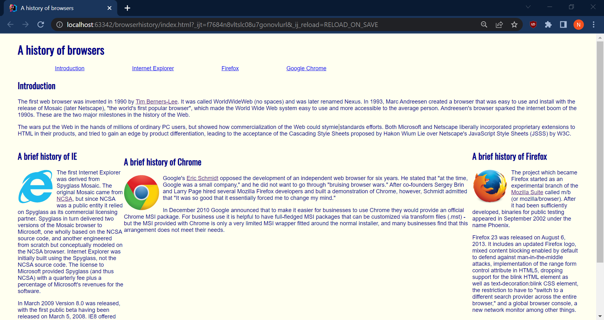
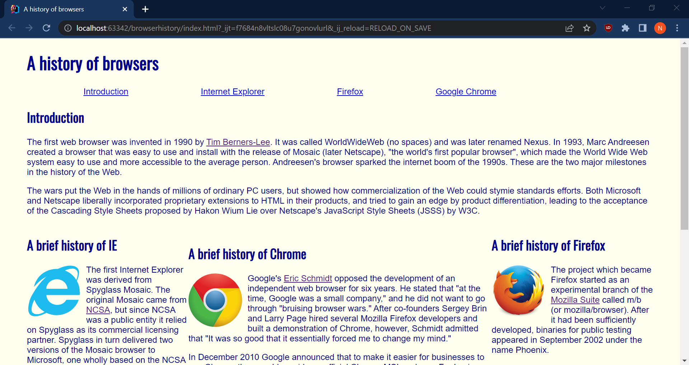
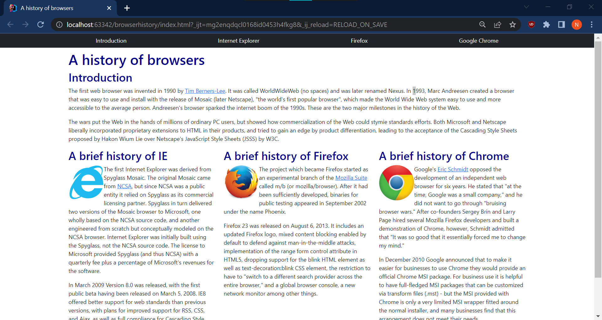
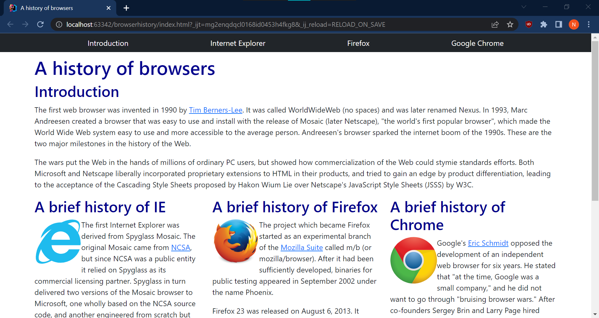

## As someone who just started designing web pages a couple of weeks ago, 

I can simply say that using UI Frameworks makes it a lot easier to create better and modern looking websites. Although I only have experience using the Bootstrap framework, it is clear to see how powerful the addition of a framework can be in designing web pages. In this essay, I will share my personal opinions about the many improvements in designing web pages that utilize Bootstrap over raw HTML & CSS. 

## First off..

Bootstrap is extremely simple to implement and easy to use. In order to implement Bootstrap (or Bootstrap Icons), we just need to load the Bootstrap CSS and Javascript files (or Bootstrap Icon stylesheet) in the head of the HTML file. To use Bootstrap, we just add a class with shorthand notation to an HTML element. This makes it 100-fold easier to align content, center elements, or space items. In addition, Bootstrap has a dedicated documentation of all of the  properties that can be used to design a web page.

## Secondly..

Bootstrap easily adjusts a web page to many different viewing settings in a browser. The same reason is true across different devices as well, like smartphones, tablets, laptops, and desktops. For example when zooming in/out of a web page, every component of the web page should still remain the same, that is everything is aligned and spaced out properly. The only property that changes is the viewing of the web page, which makes the web page smaller (when zooming out) or larger (when zooming in). In raw HTML & CSS, it is easier for the web page to be inconsistent across different viewing settings. Take for example last week’s Browser History WOD using columns. The middle column does not have a fixed width of 300 pixels, instead the width varies on the viewing setting.

### Examples of Columns in Raw HTML & CSS

  

    
    
  

The left image is 75% zoom. The right image is 100% zoom.

### Examples of Columns in Bootstrap

  

    
    
  

The left image is 75% zoom. The right image is 100% zoom.

## Lastly..

When designing web pages with Bootstrap it is simple to notice that most of the process is done in HTML and less is done in CSS. This change makes it easier to “visualize” a web page just by looking at the HTML, not that it was difficult before when just using raw HTML. However, when you add raw CSS into the mix, which has all of the styling rules, then it is not as easy to “visualize” a web page by looking at code. In fact, just viewing the web page from the browser would be more simple than swapping between the HTML & CSS tabs. This change also makes CSS become more simple to use, mainly because we do not need to bother with adjusting the margin, border, and padding properties. Now CSS primarily styles the background and color properties, things that usually remain the same in a web page. 

## Conclusion

To summarize, there are lots of advantages when designing web pages using UI Frameworks over raw HTML & CSS. As stated above, a UI Framework like Bootstrap can be simple and easy to use, auto adjusts the web page to the viewing settings in browsers, and the ability to visualize a web page when looking at the code. Also, using UI Frameworks creates a more modern looking web page. In fact, I’ve been satisfied with the end product of every web page that I’ve created using Bootstrap. When only using raw HTML & CSS for designing web pages, there are bound to be lots of struggles and frustration along the way, unless if you are looking to create an old-fashioned web page that predates the Windows 7 operating system. 
