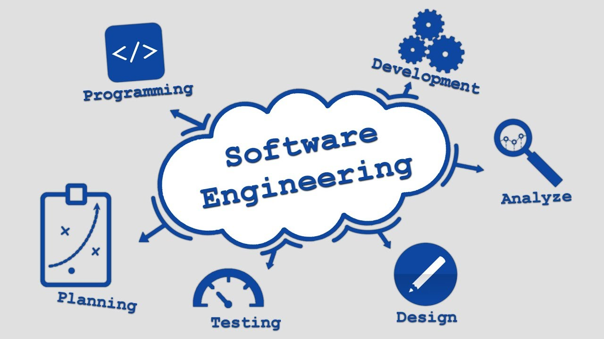

## Prior to taking ICS 314, 

I did not have the slightest clue as to how web pages or web applications are made. But throughout the past semester, we have been actively learning about software engineering and actively participating in building web applications. Although this class is geared towards web development, there are still useful concepts to keep in mind in any software engineering project. In this essay, I will be discussing three ideas: configuration management; user interface frameworks; and design patterns.

## Configuration Management

When working on either a large or small project, alone or as a team, it's important to keep track of all versions and configurations of the project. In computing terms, version refers to a file and its evolution over time, and configuration refers to a set of files which produces a working program/system. By tracking these we are able to address issues that could appear at any point in the project. This is the broad idea of configuration management. There are many variations of configuration management, one special case is “version control”, where the main concern is maintaining multiple versions of the system. The configuration management we used in this course is a distributed version control system, or more widely known as Git and Github. This system allows users to create complete copies of the repository (including history) and locally modify files. To collaborate with other users working on the same repository, they will have to push and pull (send and receive) their changes to other users' repositories. Configuration management is an extremely powerful notion that helps companies and users organize and manage small or large-scale projects.

## User Interface Frameworks

If you’ve ever designed a web page in raw HTML and CSS, it is often difficult and frustrating to get things to look perfect. This is where frameworks come in, a platform which provides generic functionality for a developer to manipulate in order to fit their needs. And oftentimes, frameworks also improve software reliability, faster programming, simpler testing, and modern looking design. A “User Interface Framework” is a framework specifically designed to develop user interfaces. In this course we used Bootstrap, a responsive UI Framework. A common problem in any UI design is accommodating all the different operating systems and many types of devices (i.e. desktop, laptop, tablet, and phones), which is usually solved by coding each one separately. Bootstrap is responsive or “mobile first” which does not require special or additional code to reformat the UI for different screen sizes. Ultimately, frameworks are convenient platforms that assist developers in the process of building an application. 

## Design Patterns

A similar conception to frameworks is design patterns. As I’ve discussed in the [**previous essay**](https://nickkaw.github.io/essays/design-patterns.html), design patterns are templates that can be used in many different situations to guide how a problem should be addressed. They are used to help developers produce typical solutions in an effort to quickly solve recurring problems and reduce errors in development. The predominant design pattern that we used throughout this course is the Model-View-Controller (MVC) pattern. This allows us to divide a web application into three components: model (which is usually the databases); view (which is how things are rendered on a page); and controller (which controls what the client sees when interacting with the application). In the end, design patterns are convenient ideas and solutions that developers can use to solve problems. 

## To conclude, 
Throughout the past semester we learned a lot of software engineering concepts while building web applications. In the future if I were to create and develop more software applications, then I would never want to forget these three ideas. I believe that configuration management, user interface frameworks, and design patterns are the most important topics towards becoming a proper software engineer. However, there are obviously many other important concepts that appear in the field of software engineering. It will be wise to know all of them before going to an interview for an internship or position in my future career.
