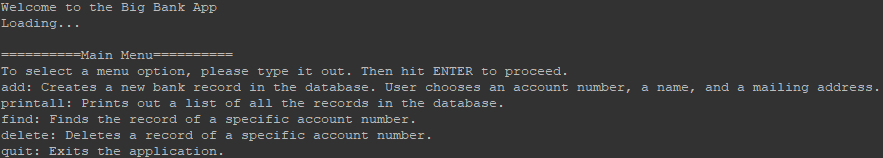

This Bank Database project is an application I made using C++ in the fall of 2021 for ICS 212. 

The goal of this project was to use our knowledge of C++ libraries, functions, and pointers to create the front-end and back-end of a bank database application. The front-end consists of the user interface, which interacts with the user by displaying the menu and asking the user for input. The back-end consists of all the working functions that are called from the front-end, and handles the received user input to produce the desired output.

Thanks to this project, I know how it feels to write over 500 lines of code. I’ve realized that looking at large blocks of code can be difficult to read through. This is the importance of commenting on functions and coding standards, even though some of the extra lines may be from following coding standards and commenting on functions, it helps to organize your code into readable chunks.

Here is a [link](https://github.com/nickkaw/bankdb-ics212) to the entire project file in github.
