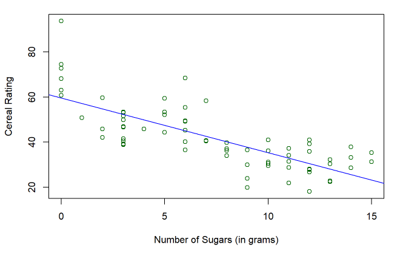

This Cereal Research Project is that I conducted using R Markdown in RStudio in the fall of 2021 for ECON 425. 

The goal of this project was to apply our knowledge of econometrics into a research project. That is to create a question about a relationship between two things, find an appropriate dataset, and then use statistical methods and economic models to prove whether or not that relationship is true.

Above is an example of one of the stronger relationships that I've regressed, with the number of sugars on the x axis, and rating of the cereal on the y axis.

Although I’ve used RStudio before, it was the first time using R Markdown or any implementation of Markdown. Markdown is a simple plain text editor that is useful for creating documents. R Markdown differs by the fact that you can insert blocks of R code/script into the Markdown, making it easier to add code, graphs, and more into a seamless and fluid document.

Here is a [<u>link</u>](https://github.com/nickkaw/cereal-econ425/blob/main/ResearchProj.md) to the document in github.

