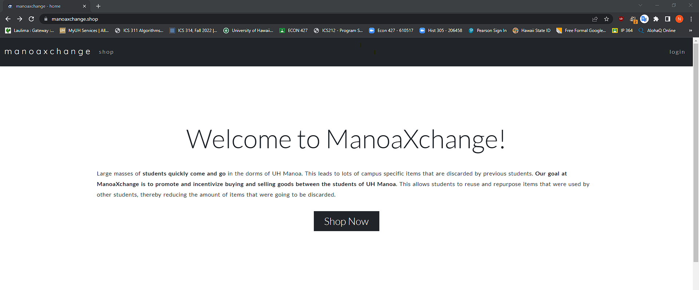

In this project, my team and I were tasked to create an application that would help promote and incentivize buying and selling goods between the people of UH Manoa. Since this application is designed for a specific demographic, it allows campus related goods to be reused and repurposed, which ultimately reduces the amount of items that would have potentially been discarded. Essentially we are building a web application that is similar to Craigslist but designed for UH Manoa students, faculty, and alumni.

Manoa Xchange is the application that we created to address the issues above. In our application, we have a marketplace where anybody can view listed items and filter by pre-made categories or search for an item using the search bar. You can click on any item to view more details and/or report an item for sale, but in order to take advantage of the full functionality of our application you will need to register and login using your UH email address. The additional functionality of having an account includes being able to message sellers about an item for sale, listing your own items for sale, browsing other accounts, rating other accounts, viewing the items for sale of other accounts, and setting up a profile. Administrators are capable of viewing listed items that have been reported and may remove items on the marketplace if deemed inappropriate. Here is a snapshot of our application landing page : 

In this application, I was primarily responsible for everything that involved the user profile. This includes: creating the databases for the profiles and ratings collection; creating the forms for registration new user, editing own profile, and rating a profile; creating the pages (before the website redesign) for registration, user profile, and edit profile; and finally making sure that it all functions correctly. In addition to that I was also responsible for testing every page and form of our application using TestCafe. Out of all of the accomplishments, I felt very proud after finally completing the rating system (which I believe is a very clever implementation). 

It has been quite a while since I’ve worked on a computer science group project, let alone any group project, and this one was long and definitely the most challenging group project to date. Although I had some familiarity with web development using Javascript, React Bootstrap, and Meteor elements before this project, there were still many things that I’ve learned along the way. For instance, I learned about deploying websites to the web, adding domain names and https. Also in this project I was able to manage versions and configurations with my group by practicing [**Issue Driven Project Management**](https://courses.ics.hawaii.edu/ics314f22/morea/project-management/reading-guidelines-idpm.html) (IDPM) in Github. Even if it was not a perfect example of an IDPM, it still smoothened the development process of our application. Lastly, I learned about creating simple acceptance tests using TestCafe. At first it was honestly frustrating learning to create acceptance tests, but it became easier along the way as I got better at making the tests. However, it does become extremely time consuming to make these tests. Safe to say, I was completely satisfied with the way our web application turned out in the end and I hope to use this knowledge in the future and build upon my experiences.

Our deployed web application can be viewed at [**Manoa Xchange**](https://manoaxchange.shop/), or if you want to learn more about our application then visit our [**project home page**](https://manoaxchange.github.io/).
